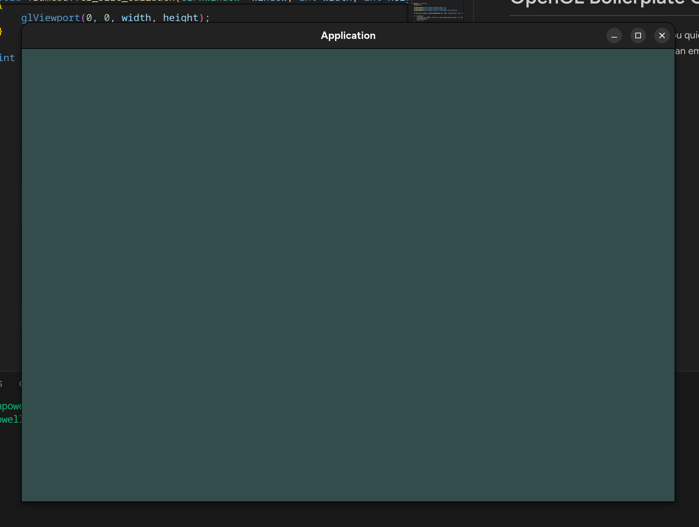

# OpenGL Boilerplate Code

This is a bare bones project to help you quickstart your OpenGL projects with GLFW, GLAD, and Cmake. The boilerplate code displays an empty OpenGL window - what you do with it from there is up to you!

This code is developed and tested on Fedora Linux, but should be portable to other platforms.

